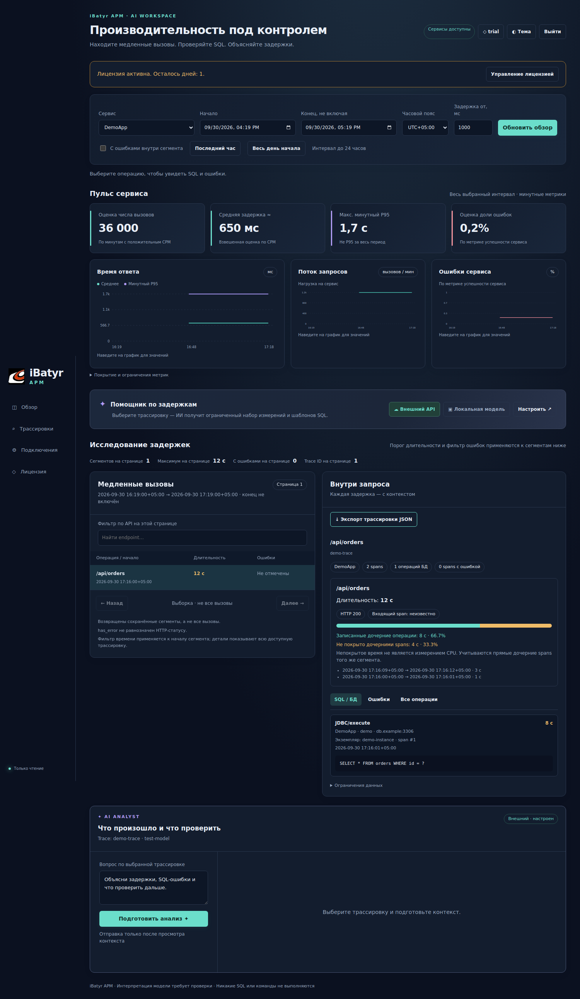
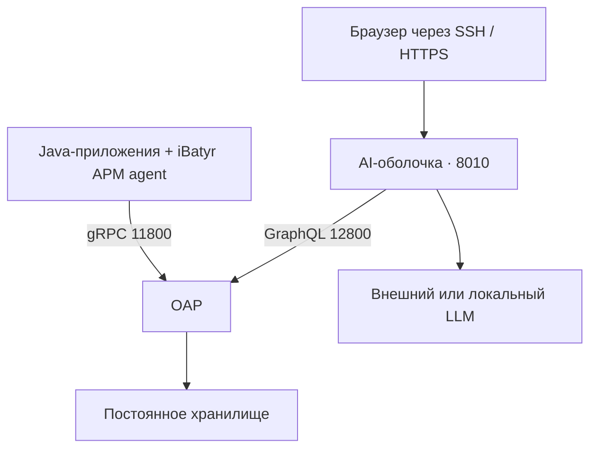

<p align="center"></p>
<h1 align="center">iBatyr APM</h1>
<p align="center"><strong>От медленного API к SQL и доказательствам в трассировке</strong></p>
<p align="center">Мониторинг · Диагностика задержек · AI-анализ · Offline-лицензии</p>

**0.5.0-rc1 — кандидат для стенда.** Самостоятельная AI-оболочка и установщики
сервера/Java-агента. Не требуется старый каталог `~/skywalking-ai/backend`.
Перед клиентским production-развёртыванием пройдите [приёмку](docs/VALIDATION.md).

[Релизы](https://github.com/networkyeldar/ibatyr-apm/releases) · [CI](https://github.com/networkyeldar/ibatyr-apm/actions) · [Быстрый старт](#быстрый-старт) · [Elasticsearch с нуля](docs/ELASTICSEARCH.md) · [Алерты и Live](docs/ALERTS.md) · [JVM](docs/JVM.md) · [Сервер](docs/SERVER.md) · [Агент](docs/AGENT.md) ·
[Лицензирование](docs/LICENSING.md) · [Обслуживание](docs/OPERATIONS.md) ·
[GitHub и релизы](docs/GITHUB.md) · [Результаты проверок](docs/VALIDATION.md)

## Что получает оператор

- Критичные алерты OAP, исходные теги и переход к интервалу диагностики.
- Live-обновление 15/30/60 с, интерактивные графики и сохранение выбранной трассировки.
- Фильтры по дате, времени, сервису, длительности и признаку ошибки.
- Обзор трафика и задержек; переход от сегмента к SQL и ошибкам конкретного span.
- Покрытие входящего HTTP-вызова дочерними spans с учётом пересечений.
- Выбор внешнего или локального OpenAI-совместимого LLM с авторизацией.
- Предпросмотр сокращённых данных перед отправкой модели; вывод со ссылками на evidence.
- Вход по паролю, offline-лицензия trial/paid, экспорт выбранной трассировки.

AI анализирует **одну выбранную трассировку**. Сохранённые traces — выборка,
а непокрытые интервалы не доказывают нагрузку CPU. Пароли/API-ключи хранятся
локально с правами 0600; открытый доступ в интернет по HTTP не предусмотрен.

## Быстрый старт

Целевая система: **Ubuntu 24.04, Python 3.12, systemd**. Для OAP — Java 17.
Docker не нужен. Elasticsearch устанавливается отдельно из официального APT 8.x. Команды выполняются из корня распакованного пакета/репозитория.
Установщик — для первой установки; занятые порты и существующие каталоги не перезаписываются.

### Получить исходники

```bash
git clone https://github.com/networkyeldar/ibatyr-apm.git
cd ibatyr-apm
```

Для фиксированной версии скачайте соответствующий Release. `main` может содержать
изменения, ещё не прошедшие клиентскую приёмку.

### Уже есть OAP

```bash
sudo apt-get update
sudo apt-get install -y python3-venv ca-certificates
sudo python3 install.py shell --oap http://127.0.0.1:12800/graphql
```

Установщик запросит логин и пароль оболочки (12+ символов), настроит
`ibatyr-apm.service` и проверит `/ready`. Зависимости Python загружаются из PyPI.

На рабочем компьютере откройте туннель (замените USER и SERVER_IP):

```bash
ssh -N -L 18010:127.0.0.1:8010 USER@SERVER_IP
```

Откройте **http://127.0.0.1:18010/ai/**. Настройте LLM и активируйте
[лицензию](docs/LICENSING.md). Обычный просмотр не требует AI-лицензии.

### Чистая VM: постоянное хранилище Elasticsearch

```bash
sudo apt-get update
sudo apt-get install -y python3-venv openjdk-17-jre-headless ca-certificates
sudo python3 install.py elasticsearch --version 8.19.22 --heap-gb 2
sudo python3 install.py server --storage elasticsearch --local-elasticsearch --agent-bind 192.0.2.10
sudo python3 install.py shell --public-key /полный/путь/public.pem
```

Замените IP на приватный адрес VM, путь — на публичный ключ издателя.
Установка рассчитана на чистую VM с 8+ GiB RAM. Elasticsearch локальный, HTTPS,
аутентификация, данные на диске, отдельный OAP user. Точная версия 8.x.y обязательна;
её совместимость с OAP и полную установку проверьте на стенде.
[Пошаговая инструкция, проверка и восстановление](docs/ELASTICSEARCH.md).

### Чистая VM: демонстрационный стенд

```bash
sudo apt-get update
sudo apt-get install -y python3-venv openjdk-17-jre-headless ca-certificates
sudo python3 install.py server --storage demo
sudo python3 install.py shell
```

**DEMO использует H2 в памяти: данные теряются при остановке OAP.**
Это проверка установки. Для клиента используйте [постоянное хранилище](docs/SERVER.md).
По умолчанию приём агента доступен только с этой VM. Для удалённых приложений
задайте `--agent-bind` с приватным IPv4 сервера и настройте сетевой ACL.

### На сервере Java-приложения

Из agent-пакета или репозитория:

```bash
sudo python3 install.py agent \
  --collector 192.0.2.10:11800 \
  --service-name MyApplication \
  --app-user appuser
```

Адрес и `appuser` — примеры, замените своими. Установщик выведет JVM-параметры.
Добавьте их **перед `-jar`**, затем перезапустите только приложение в согласованное окно.
Подробнее: [обычный Java-процесс и systemd](docs/AGENT.md).

## Интерфейс

Отдельный раздел **JVM**: CPU, Heap, GC, потоки и классы с выбором экземпляра,
историческим периодом и Live. [Единицы, ограничения и обновление](docs/JVM.md).



Скриншот использует синтетические данные, не данные клиента.

## Архитектура



OAP и оболочка могут находиться на одной VM. Агент устанавливается в JVM
приложения. LLM может находиться в другой сети и подключается отдельно.

## Состав репозитория

| Каталог/файл | Назначение |
|---|---|
| `shell/` | Полный FastAPI backend и веб-интерфейс |
| `install.py` | Установка Elasticsearch, оболочки, OAP или агента |
| `versions.json` | Зафиксированные upstream-версии, URL и SHA-512 |
| `tools/issuer.py` | Выпуск лицензий **на компьютере издателя** |
| `tools/build_release.py` | Три клиентских пакета и SHA256SUMS |
| `tools/doctor.py` | Проверка OAP, схемы и готовности оболочки |
| `docs/` | Установка, лицензии, обслуживание, проверки |
| `tests/` | Авторизация, лицензии, данные и безопасность распаковки |
| `.github/workflows/` | CI и сборка draft release |
| `legal/` | Сторонние компоненты и проект коммерческих условий |

## Получение дистрибутивов

Сборщик пакетов требует Python 3.12+. Готовые пакеты скачиваются из Releases
без локальной пересборки.

```bash
python3 tools/build_release.py --with-vendor
```

В `packages/` появятся:

- `ibatyr-apm-shell-0.5.0-rc1.tar.gz` — самостоятельная оболочка.
- `ibatyr-apm-server-0.5.0-rc1.tar.gz` — установщик и официальный OAP внутри.
- `ibatyr-apm-agent-0.5.0-rc1.tar.gz` — установщик и официальный Java agent внутри.
- `SHA256SUMS` — контрольные суммы пакетов.

Без `--with-vendor` пакеты загрузят upstream при установке и проверят SHA-512.
Пакеты с upstream всё равно требуют установленного Python/Java; оболочка требует
интернета для pip. Полностью автономный wheelhouse в этот релиз не входит.
В клиентских пакетах нет issuer, закрытых ключей и конфигурации издателя.

## Версии и ограничения

Базовая версия OAP **10.1.0** выбрана для соответствия ранее проверенному серверу.
Java agent **9.3.0** — зафиксированная версия этого стенда, не утверждение о версии
агента на вашем рабочем приложении. Это архивные upstream-релизы, а не обещание
актуальной поддержки или отсутствия уязвимостей. Перед продажей обновление и
security review выполняются отдельным этапом с повторной приёмкой.

Текущий релиз: GENERAL Java services; один Uvicorn worker; один аккаунт;
AI-лицензия без лимита агентов; нет SSO/RBAC/HA/биллинга/онлайн-отзыва.
Старые экспериментальные `/service-overview` и `/service-summary` в standalone
сборку не входят — текущий UI использует `/dashboard`.

## Сторонние компоненты

В основе ядра мониторинга и Java-агента — Apache SkyWalking (Apache License 2.0).
iBatyr APM не является официальным выпуском Apache Software Foundation.
Оригинальные LICENSE/NOTICE остаются в пакетах. Собственные условия и права
на upstream разделены: [legal/COMPONENTS.txt](legal/COMPONENTS.txt).
