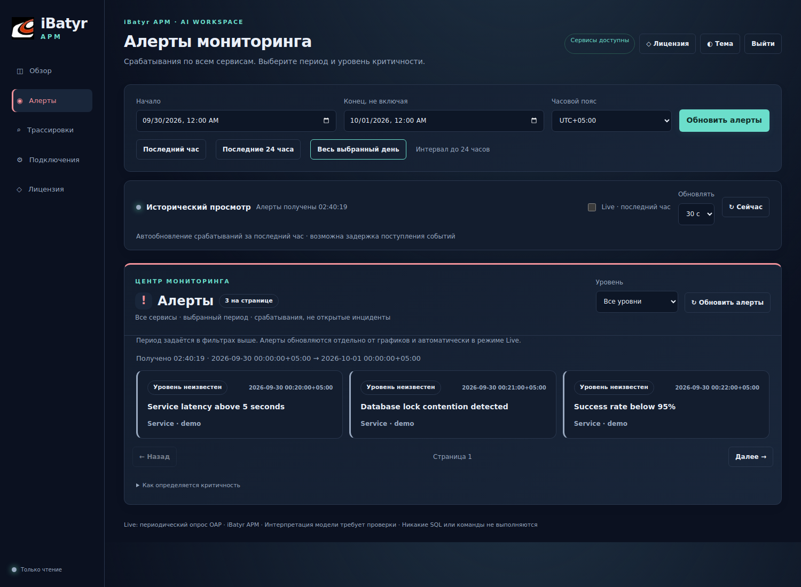
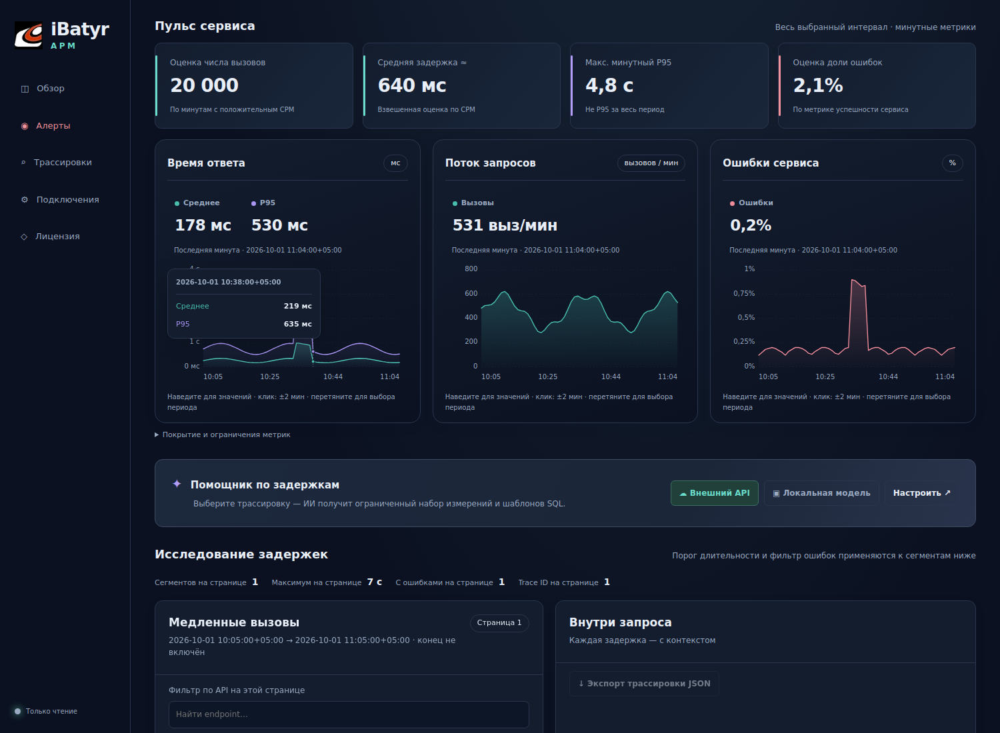

# Алерты и Live-дашборд

## Источник и критичность

Панель читает сохранённые срабатывания через OAP 10.1.0 `getAlarm`.
Она показывает **все сервисы за выбранный интервал**, независимо от сервиса в фильтре
метрик. По умолчанию запрос отбирает `level=CRITICAL` на стороне OAP; доступны HIGH,
WARNING и все уровни. Строки без тега отображаются как «Уровень неизвестен».
Никакой классификации по тексту или LLM для присвоения уровня нет.

`level` входит в стандартный список searchableAlarmTags. Если меняли
`SW_SEARCHABLE_ALARM_TAG_KEYS`, сохраните `level` в списке. Значения правил задавайте
в верхнем регистре. Старые срабатывания без тега не становятся CRITICAL задним числом.
При неподдерживаемой схеме/ошибке источника UI показывает ошибку, а не «0 проблем».

API не сообщает resolved/acknowledged и общее количество записей. Поэтому карточки —
срабатывания, а не активные инциденты. Сортировка по уровню и времени — внутри страницы;
пагинация относится к исходной выборке OAP. После фильтрации границ страница может быть
пустой и всё ещё иметь следующую страницу. Подсчёт на карточке относится к странице.

## Новая установка

`install.py server` по умолчанию применяет `config/ibatyr-alarm-settings.yml`:

| Правило | Условие | Уровень |
|---|---|---|
| Задержка сервиса | Среднее > 5000 мс в 3 из 5 минут | CRITICAL |
| Успешность сервиса | SLA < 95% в 3 из 5 минут | CRITICAL |
| Задержка обращений к БД | Среднее > 5000 мс в 3 из 5 минут | CRITICAL |

Silence period: 5 минут. Это стартовые пороги, согласуйте их с SLO клиента.
Правило SLA не учитывает минимальный размер выборки: проверяйте CPM при разборе.
Установщик сохраняет исходные правила в `alarm-settings.yml.upstream`.
Для сохранения стандартных правил используйте `--alarm-rules upstream`.

## Существующий сервер / Wazuh alarm receiver

Сделайте backup действующего `config/alarm-settings.yml`. Перенесите три именованных
правила **внутрь существующего `rules:`**, сохранив все прежние правила и `hooks`.
Не заменяйте файл целиком: иначе потеряете маршрутизацию, например на Wazuh.
Если используются dynamic configuration providers, меняйте конфигурацию в их источнике.
Примените штатный reload либо перезапустите OAP в согласованное окно; проверьте журнал
загрузки правил и одно контролируемое срабатывание на стенде.

Подготовленные правила используют штатные метрики OAP. Если у сервиса/БД нет данных,
отсутствие срабатывания не означает доступность. SQL конкретного медленного запроса
исследуется в trace; алерт по метрике БД сам по себе не содержит SQL/Trace ID.

## Интерактивный интерфейс

- Live: скользящий последний час, опрос каждые 15/30/60 секунд (по умолчанию 30).
  Окно заканчивается за две минуты до текущего времени для снижения влияния неполных
  минут. Это near-real-time, не мгновенная потоковая доставка.
- В скрытой вкладке новые опросы не запускаются. После сетевой ошибки интервал
  увеличивается до 4×; предыдущие данные остаются с отметкой об устаревании.
- Ручная смена фильтра/даты, выбор минуты на графике или пагинация выключают Live.
- Графики: переключение рядов, tooltip/crosshair, клавиши ←/→, Enter или клик
  открывают интервал ±2 минуты для исследования traces.
- Алерт: детали, исходные теги, переход к интервалу ±5 минут. Сервис сопоставляется
  только по точному Service ID; иначе UI явно использует выбранный сервис.
- Автообновление не сбрасывает выбранный trace и AI-контекст, не отправляет запросы LLM.
- Тёмная/светлая темы, мобильная компоновка и reduced-motion.

Для curl сначала авторизуйтесь в оболочке; `/api/ai/alerts` защищён существующей
сессией так же, как трассировки. Параметры: start/end (ISO-8601 с timezone), severity,
page, page_size (до 50). Конец интервала исключён, максимум 24 часа.

Источник протокола: `query-protocol/alarm.graphqls` из проверенного архива OAP 10.1.0;
[правила OAP 10.1.0](https://skywalking.apache.org/docs/main/v10.1.0/en/setup/backend/backend-alarm/).

## Отдельный экран алертов

Пункт «Алерты» в боковом меню открывает `/ai/#alerts-panel`.
На этом экране показаны только фильтры времени, Live и события. Графики,
трассировки и AI-панель скрыты. «Обзор» возвращает к метрикам, а «Трассировки» —
к исследованию запросов. На телефоне переключатель находится в шапке.
Обновление и Live запрашивают данные только текущего экрана.
Переход «Исследовать интервал» из карточки алерта открывает экран трассировок.
У алертов общий период с обзором; фильтры сервиса и длительности на экране алертов
не показываются, поскольку события запрашиваются по всем сервисам.

Пример отдельного экрана на синтетических данных:

## Выбор дня

Кнопки периода сразу запускают загрузку данных текущего экрана и выключают Live:

- «Последний час»: 60 минут, с отступом две минуты для поступления метрик.
- «Последние 24 часа»: скользящие 24 часа с тем же отступом.
- «Весь выбранный день»: дата поля «Начало», 00:00 → 00:00 следующего дня
  в выбранном часовом поясе; конец исключён.

Ручное редактирование дат требует кнопки «Обновить обзор» / «Обновить алерты».
Максимальный интервал — 24 часа. Изменение исправляет прежнюю кнопку дня,
которая только заполняла поля и не отправляла запрос.
Отсутствие сохранённых данных и таймаут OAP остаются возможными; UI показывает
ошибку, если запрос не завершился успешно. Исторические данные не создаются автоматически.

## Обновлённые графики

Графики показывают значения последней минуты, единицы задержки (мс / с / мин),
подсказку у курсора и точки на выбранной минуте. Кнопки рядов скрывают и показывают
линии. Перетаскивание мышью выделяет интервал и открывает его метрики и трассировки;
клик выбирает ±2 минуты. Стрелки и Enter позволяют работать с клавиатуры.
Переход к интервалу выключает Live. Пропущенные наблюдения остаются разрывами.
Заливка под линией — оформление, она не добавляет измерений и не сглаживает пики.
Обновление данных по-прежнему выполняется каждые 15/30/60 секунд при включённом Live.

Пример на синтетических тестовых данных (не данные сервера клиента):

